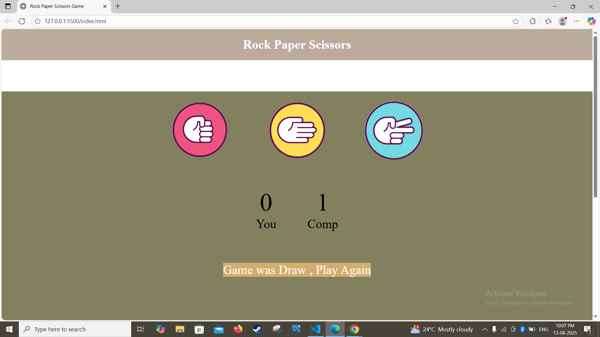

# 🎮 Rock Paper Scissors Game  

An interactive **Rock Paper Scissors** game built with **HTML, CSS, and JavaScript**.  
This project demonstrates DOM manipulation, event handling, and basic game logic in JavaScript, combined with a responsive UI design.

---

## 📌 Features  

- ✋ **Play against the computer** in a classic rock-paper-scissors match.  
- 🎨 **Responsive design** – works on desktop and mobile.  
- ⚡ **Real-time results** with score tracking.  
- 🔄 **Random computer choices** for fairness.  
- 🖌 **Custom styling** for an engaging experience.  

---

## 🛠 Technologies Used  

- **HTML5** – Structure and layout.  
- **CSS3** – Styling and responsiveness.  
- **JavaScript (Vanilla JS)** – Game logic and interactivity.  

---

## 🚀 How to Play  

1. Open the game in your browser.  
2. Choose **Rock**, **Paper**, or **Scissors** by clicking the buttons.  
3. The computer will randomly make a choice.  
4. The result and updated scores will be displayed instantly.  

---

## 📷 Screenshots  

*(Add screenshots here to showcase your UI — drag image files into this README or link them)*  

Example:  

---

## 📂 Project Structure  

